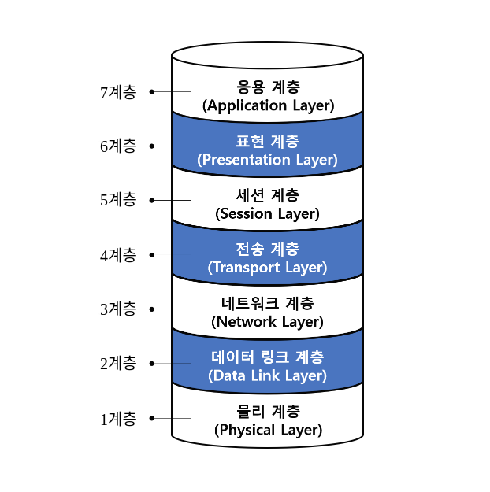
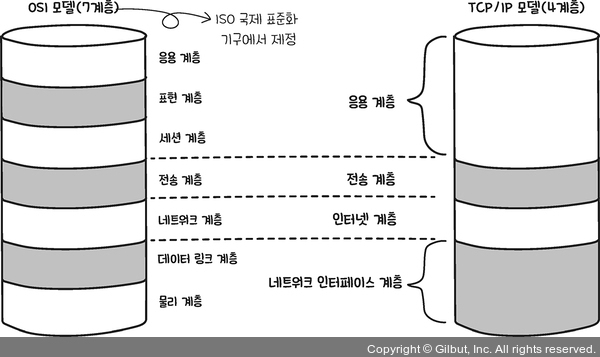

# 2장 네트워크 통신을 위한 약속

## Lesson05 네트워크의 규칙, 프로토콜

- 프로토콜: 컴퓨터나 원거리 통신 장비사이에서 메시지를 주고받는 양식과 규칙의 세계
- 네트워크에서 대표적인 프로토콜로 사용되는 것: OSI 7계층, TCP/IP 4계층

## Lesson06 OSI 계층과 TCP/IP 4계층

- 네트워크에 대한 표준 제시 (OSI 7계층)

### 1. OSI 계층이 등장한 배경

- 컴퓨터와 컴퓨터가 통신을 하기 위해 필요한 것을 7개 계층으로 분리해놓은 것
- 다양한 제조사에서 만든 컴퓨터와 허브, 스위치, 라우터로 통신해야함
- 하지만, 제조사마다 자신들만의 프로토콜을 사용하기 때문에 장비들은 서로 호환되지 않은 경우가 많았음
- 그래서, ISO는 컴퓨터 간의 통신이 가능하도록 OSI 7계층이라는 표준을 제저ㅇ

### 2. OSI 7계층

- 컴퓨터와 컴퓨터가 통신하는 구조를 7개의 계층으로 전의해둔 프로토콜
- OSI 계층 설명
  - 7계층(응용 계층): 사용자와 애플리케이션 간의 소통
  - 6계층(표현 계층): 데이터를 어떻게 표현할지 정의
  - 5계층(세션 계층): 통신을 설정, 관리, 종료(일반적으로 통신을 위한 세션을 체결)
  - 4계층(전송 계층): 신뢰성 있는 정확한 데이터 전달
  - 3계층(네트워크 계층): 네트워크 장치 간의 경로 선택과 데이터 전송
  - 2계층(데이터 링크 계층): 물리적인 연결을 통해 오류 없는 데이터 전달
  - 1계층(물리 계층): 전기 신호를 이용해서 통신 케이블로 데이터를 전송
- 송신자 관점: 응용 계층에서 시작된 통신은 물리 계층에서 끝남
- 수신자 관점: 물리 계층에서 시작하여 응용 계층에서 끝남
- 계층을 나눌 뎨 효과
  - 통신이 일어나는 과정을 단계별로 확인할 수 있음
  - 통신에 문제가 발생했을 때 원인 파악 및 해결이 쉬움
- OSI 7계층은 이론적인 표준안 -> 현실에 적용하기에는 계층이 너무 많음
- 효육적으로 사용하기 위해 등장한 것이 TCP/IP 4계층 (사실상 표준)

### 3. TCP/IP 4계층

- OSI 7계층을 기반으로 만들어진 인터넷 표준
- TCP/IP 계층 설명
  - 4계층(응용 계층): 사용자와 애플리케이션 간의 소통
  - 3계층(전송 계층): 신뢰성 있는 정확한 데이터 전달
  - 2계층(인터넷 계층): 물리적으로 데이터가 네트워크를 통해 어떻게 전송되는지를 정의
  - 1계층(네트워크 인터페이스 계층): 데이터를 전기 신호로 변환한 뒤 데이터 전송

## Lesson07 OSI 7계층에서의 데이터 표현

- OSI 7계층마다 데이터를 부르는 용어가 다름
  - 응용 계층 ~ 세션 계층: 데이터 | 메세지
  - 전송 계층: 세그먼트
  - 네트워크 계층: 패킷
  - 데이터 링크 계층: 프레임
  - 물리 계층: 비트
- 데이터는 한 단계씩 내려가면서 통신을 위한 정보가 하나씩 추가로 붙게 됨
  - 세그먼트: 포트번호
    - 포트번호: 애플리케이션을 구분하기 위한 번호
  - 패킷: 송,수신자의 IP 주소
    - IP 주소: 인터넷에 연결되어 있는 모든 장치를 식별할 수 있도록 각각의 장치에 부여된 고유 주소
  - 프레임: 송,수신자의 MAC 주소
    - MAC 주소: 하드웨어 장치에 할당된 주소
  - IP 주소 vs MAC 주소
    - 모두 고유 번호이지만 용도가 다름
    - IP 주소는 KT, SKT, LG 등의 인터넷을 가입하면 할당받는 주소
    - MAC 주소는 컴퓨터를 구매할 때부터 할당되어 있는 기기의 고유 번호이며 데이터 링크 계층에서 사용됨

## Lesso08 캡슐화와 역캡슐화

- 각 계층을 지나면서 덧붙여지는 정보를 헤더라고 함

### 1. 캡슐화

- 계층에 따라 정보를 담은 헤더를 데이터에 붙여나가는 과정을 의미
- 헤더 정보
  - 전송 계층: 포트 정보
  - 네트워크 계층: 송수신자의 IP 정보
  - 데이터 링크 계층: 송수신자의 MAC 주소, 트레일러
    - 트레일러: 전달한 데이터에 오류가 없는지 검출하기 위한 용도로 사용

### 2. 역캡슐화

- 헤더 정보가 하나씩 벗겨지는 것을 의미

## Lesson09 VPN

- VPN(Virtual Private Network, 가상사설망)
- 인터넷을 통해 데이터를 안전하게 전송하기 위한 기술
- 동작 방식
  - VPN 클라이언트 소프트웨어 설치
  - VPN 서버 연결 및 인증
    - VPN 클라이언트 소프트웨어를 사용하여 VPN 서버에 연결
    - 사용자 이름과 암호를 사용하여 인등
  - 데이터 암호화
    - VPN 연결이 설정되면 모든 데이터는 암호화되어 전송됨
    - 데이터가 인터넷을 통햇 전송될 때 누구나 볼 수 없게 만들어줌
  - 터널링
    - 네트워크 사이에 통로를 생성하는 것을 의미
  - 통신 종료되면 VPN 터널은 해제되고 VPN 연결도 종료됨
- 종류
  - IPSec(Internet Protocol Security) VPN
    - OSI 7계층: 3계층
    - 암호화: IP 패킷 암호화
    - 접속 방법: 소프트웨어를 설치하여 접속
  - SSL(Secure Socket Layer) VPN
    - OSI 7계층: 4~7계층
    - 암호화: IP: 데이터 암호화
    - 접속 방법: 웹 브라우저에서 접속
