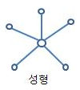
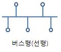
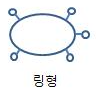
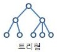
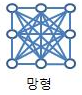

# 1장 네트워크 첫걸음
## 네트워크란?
- 두 대 이상의 컴퓨터들을 연결하고 서로 통신할 수 있는 것
- 각종 통신 장비들이 서로 그물망처럼 연결되어 데이터를 교환하거나 협력하여 일할 수 있게 해주는 통신망

## 네트워크 형태
### LAN(Local Area Network)
- 건물 안이나 특정 지역을 범위로 하는 network
- 근거리 통신망, 거리 10km 이내 제약, 고속 전송 속도
- ex) ethernet or Wi-Fi Network
### MAN(Metropolitan Area Network)
- 한 도시 정도를 아우르는 정도의 크기를 포함하는 규모
### WAN(Wide Area Network)
- 지역적으로 넓은 범위에서 데이터를 전송하기 위해 구성
- 광역 통신망, 거리 제약 없음, 저속 전송 속도
- ex) internet

## 네트워크 접속 형태(LAN의 구성방법)
### 1. 스타(Star)형 네트워크

- 중앙의 허브(교환기)를 중심으로 모든 컴퓨터나 단말 장치가 일대일 방식으로 연결된 방식
- 각 장치는 서로 직접 연결되어 있지 않다
- 네트워크 구현이 용이하다
- 각 단말기는 중앙 허브와 연결되어 있어야 하며, 다른 접속 형태보다 많은 케이블 연결이 필요하다.
- ex) 전화 통신망, 사설 교환 통신망

### 2. 버스(Bus)형 네트워크

- 공통 배선을 두고 버스(Backbone)에 모두 연결되어 있으며, 서로 동등한 권한을 가지고 통신할 수 있는 구조
- BroadCasting 방식으로 특정 노드들의 상태에 따라 네트워크의 상태가 변하지 않으며 통신 속도가 비교적 빠르며 기기의 추가, 변경, 제거 등이 비교적 용이
- 케이블 설치에 소요되는 비용이 적게 들어가며, 하나의 회선을 이용하므로 노드의 증설 및 삭제가 용이
- 거리에 민감하여 버스의 길이가 길어지면 신호 증폭을 위한 중계기(Repeater)가 필요

### 3. 링(Ring)형 네트워크

- 인접해 있는 장치끼리 연결된 구조
- 기기의 추가, 변경 및 제거가 비교적 어렵고, 연결되어 있는 특정한 어떤 노드의 장애가 발생 시 네트워크 전체의 서비스가 불가능
- 주로 근거리 통신망과 단방향 전송으로 광섬유의 특성에 적합
- 병목 현상이 드물다.

### 4. 트리(Trree)형 네트워크

- 스타형의 변형
- 대부분의 장치는 중앙 허브에 연결된 2차 허브에 연결됨
- 스타형의 접속 형태보다 하나의 중앙 허브에 더 많은 장치를 연결 가능
- 구성이 복잡하지만 트래픽 처리 능력과 신뢰성이 우수
- ex) 화상 처리 등의 특수 분산 처리용 컴퓨터 통신망에서 주로 이용되는 방식(광역 통신망)

### 5. 그물(Mesh)형 네트워크

- 각 사용자 시스템들이 임의의 다른 사용자 시스템들과 직접적으로 상호 연결되어 전체적을오 그물의 형태를 이루는 구조
- 전용 링크의 사용으로 각 연결회선이 원하는 자료의 전송을 보장해 주기 때문에 많은 장치가 공유하는 링크에서 발생할 수 있는 통신량 문제를 해결
- 하나의 링크가 고장나더라도 다른 신호 경로가 있기 때문에 네트워크 작동이 중단되는 경우가 거의 없음
- 모든 메시지는 전용선으로 보내지기 때문에 비밀유지와 보안이 우수하다.

## 네트워크 구성장치

### 허브(Hub)
- 컴퓨터와 컴퓨터 사이, 즉 네트워크 장비와 장비를 연결해주는 장치
- 연결된 기기 중 하나에서 전송된 패킷이 허브에 연결된 모든 기기로 브로드캐스팅된다.

### 스위치(Switch)
- 패킷의 목적지 주소로 지정된 기기로 이어지는 포트로만 패킷이 전달된다.
- 대역폭을 더 효율적으로 활용한다.

### 라우터(Router)
- 네트워크를 다른 네트워크로 연결하는데 사용

### 브리지(Bridge)
- LAN에 연결된 장비가 많을수록 데이터가 충돌할 공간이 많아지므로 그런 공간을 나누어주는 역할을 하는 장비
- MAC주소를 기반으로 전송할 포트를 결정하게 된다.

### 리피터(Repeater)
- 신호를 증폭시키는 역할을 한다.
- OSI 전송계층에서 물리계층에 속한다.

## 보강

### 대역폭(Bandwidth)
- 네트워크가 1초당 처리할 수 있는 데이터 양

### 데이터의 처리 단위
#### 비트(Bit)
- 0과 1로 구성되어 있으며 네트워크 통신에 있어서 <strong>가장 기본 단위</strong>

#### 바이트(Byte)
- 8비트이며, 사람이 인식할 수 있는 정보의 단위