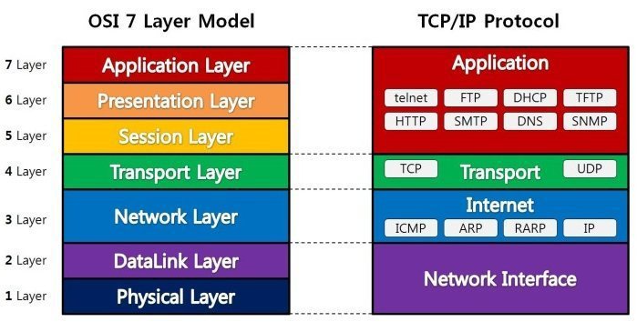
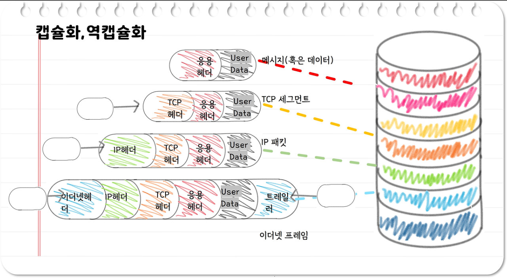

# 2장 네트워크 통신을 위한 약속
### 프로토콜?
- 컴퓨터나 원거리 통신 장비 사이에서 메시지를 주고받는 양식과 규칙의 체계

## OSI 7계층
#### 컴퓨터 간의 통신을 위한 표준

### 등장 배경
- 통신 기술이 발달되면서 컴퓨터 간 네트워킹을 할 때 다양한 프로토콜과 표준이 혼재되어 혼란스러웠고 국제표준화기구(ISO)에서 이 문제를 해결하기 위해 네트워크 표준 모듈인 OSI 7 Layer를 발표

### 계층을 나누어 얻을 수 있는 효과
- 통신이 일어나는 과정을 단계별로 확인이 가능
- 통신에 문제 발생 시 원인 파악 및 해결이 쉽다.

### 계층 설명

7계층 - 응용계층 - Application Layer
- 사용자와 애플리케이션 간의 소통(ex. 이메일 보내기, 웹 사이트 조회)

6계층 - 표현 계층 - Presentation Layer
- 데이터를 어떻게 표현할지 정의(ex. 데이터의 암호화, 데이터 압축 등)

5계층 - 세션 계층 - Session Layer
  - 통신을 설정, 관리, 종료(일반적으로 통신을 위한 세션을 체결)

4계층 - 전송 계층 - Transport Layer
  - 신뢰성 있는 정확한 데이터 전달

3계층 - 네트워크 계층 - Network Layer
  - 네트워크 장치 간의 경로 선택과 데이터 전송

2계층 - 데이터 링크 계층 - Data Link Layer
  - 물리적인 연결을 통해 오류 없는 데이터 전달

1계층 - 물리 계층 - Physical Layer
  - 전기 신호를 이용해서 통신 케이블로 데이터를 전송

---

OSI 7계층은 이론적인 표준안으로 적용하기에 계층이 너무 많아 이를 효율적으로 사용하기 위해 등장한 것이 <strong>TCP/IP 4계층</strong>이다.

## TCP/IP 4계층
- 4계층 - 응용계층
- 3계층 - 전송 계층
- 2계층 - 인터넷 계층
- 1계층 - 네트워크 인터페이스 계층

### Protocol Data Unit
- **Data(Message)** - Application Layer, Presentation Layer, Session Layer
- **Segment** - Transport Layer
- **Packet** - Network Layer
- **Frame** - Data Link Layer
- **Bit** - Physical Layer

### 용어집
- **Port Number**
  - 애플리케이션을 구분하기 위한 번호(ex. 검색: 80번, 이메일: 25번)
- **Ip Address**
  - 인터넷에 연결되어 있는 모든 장치를 식별할 수 있도록 각각의 장치에 부여된 고유 주소
  - 네트워크 계층에서 사용됨
  - 다른 장치와 중복되면 안됨
  - ex. ``192.168.0.63``
- **MAC Address**
  - 하드웨어 장치에 할당된 주소
  - 데이터 링크 계층에서 사용됨
  - 다른 장치와 중복되면 안됨
  - ex. ``IC-1B-B5-08-A4-2A``

## 캡슐화와 역캡슐화
- Header: 각 계층을 지나면서 덧붙여지는 정보(목적지, 출발지, 에러 체크 등의 정보들)
- **캡슐화**: 헤더가 추가되는 과정 / **역캡슐화**: 헤더가 분리되는 과정

  - [참고자료](https://brunch.co.kr/@artprogrammer64/24)
### 각 계층별 헤더 정보
- Transport Layer: Port 정보
- Network Layer: 송수신자의 IP 정보
- Data Link Layer: 송수신자의 MAC 주소, 트레일러

#### 트레일러란?
- 전달한 데이터에 오류가 없는지 검출하기 위한 용도로 사용됨

## VPN(Virtual Private Network) - 가상사설망
- 인터넷을 통해 데이터를 안전하게 전송하기 위한 기술
### 동작 방식
1. VPN Client Software 설치
2. VPN 서버 연결 및 인증
    - 사용자 이름과 암호를 사용하여 인증
3. 데이터 암호화
    - VPN 연결이 설정되면 모든 데이터는 암호화되어 전송
4. 터널링
    - 암호화된 데이터를 전송하기 위해 사용되는 기술
    - **네트워크 사이에 통로를 생성하는 기술**

### 종류
- IPSec VPN
  - Network Layer에서 활용
  - IP 패킷 암호화
  - 소프트웨어를 설치하여 접속
- SSL VPN
  - Transport Layer ~ Application Layer에서 활용
  - 데이터 암호화
  - 웹 브라우저에서 접속
